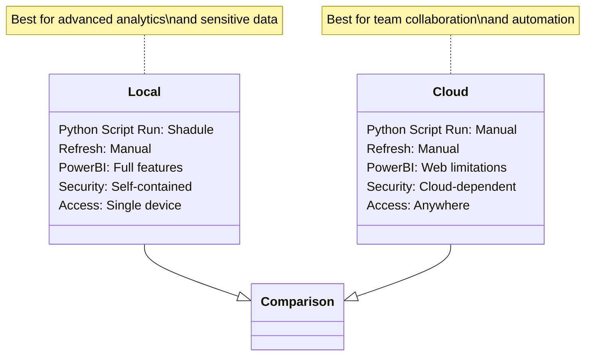

# Cryptocurrency-Data-Pipeline-Portfolio-Manager
A dual-mode solution that fetches real-time coin data from CoinGecko API and transforms it into actionable portfolio insights through Power BI.

This Power BI dashboard delivers real-time crypto market intelligence and portfolio analytics by integrating with CoinGecko's API. Designed for both active traders and long-term investors, it transforms raw market data into actionable insights through dynamic visualizations and performance metrics.

## Core Features

Live Market Data: Tracks 50+ key coins (expandable to 1,500+ via CoinGecko API) with automatic hourly refreshes (prices, volume, market cap)

Portfolio Mode: Calculates profit/loss, ROI, and asset allocation across wallets/exchanges

Technical Analytics: Moving averages, volatility indicators, and trend analysis

Risk Management: Sector diversification heatmaps and price alert thresholds

Benchmarking: Compares holdings against BTC, ETH, or custom baskets

## Technical Stack

Data Source: CoinGecko API (REST) via Power Query

Transformations: Custom M-code cleanses/normalizes JSON responses

DAX Measures: Implements time-weighted returns and moving averages

UX: Drill-through pages, mobile-responsive design

## Use Cases

Traders: Monitor live positions with P&L calculations

Fund Managers: Analyze portfolio concentration risk

Researchers: Backtest crypto strategies with historical data

## 🌐 Dual Deployment Options

Option 1: Local Environment Setup

Workflow Path:-

Execute Python script (crypto_fetcher.py) locally

Script fetches data from CoinGecko API

Data gets stored/updated in local Excel file (data/crypto_data.xlsx)

Power BI Desktop connects to this local file

Reports are developed and viewed in Power BI Desktop

Option 2: Cloud-Based Workflow (Current Implementation)

Workflow Path:-

Run Python script in Google Colab notebook

Processed data gets saved to Google Drive

Power BI Web imports data directly from Drive link

Reports are built and shared via Power BI online service

Key Considerations:-

## Power BI Preview

