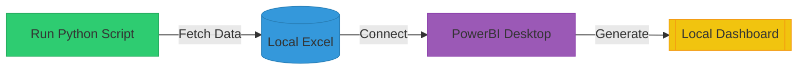
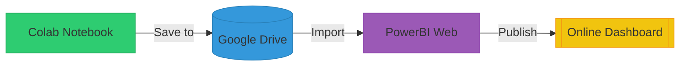
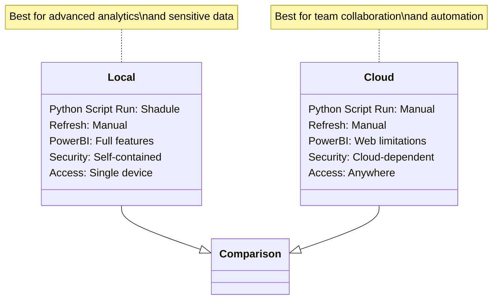

# Cryptocurrency-Data-Pipeline-Portfolio-Manager
A dual-mode solution that fetches real-time coin data from CoinGecko API and transforms it into actionable portfolio insights through Power BI.

This Power BI dashboard delivers real-time crypto market intelligence and portfolio analytics by integrating with CoinGecko's API. Designed for both active traders and long-term investors, it transforms raw market data into actionable insights through dynamic visualizations and performance metrics.

## Power BI Preview

## 📌 Key Features

### Automated Data Fetching

Fetches real-time data for 50+ (expandable 1500+ with CoinGecko API) cryptocurrencies (price, market cap, volume, dominance).

Tracks Fear & Greed Index and historical trends (BTC/ETH/BNB/SOL/SUI).

### Excel Output (crypto_portfolio.xlsx)

📊 Executive Dashboard: Top market metrics (total cap, dominance, sentiment).

📈 Market Overview: Ranked list of 50 coins with price history.

🌍 Global Metrics: Aggregate crypto market data.

😰 Fear & Greed Index: 30-day sentiment analysis.

🔄 Transactions/Portfolio Sheets: Manual entry for P/L tracking.

## Power BI Integration

Connect Excel to Power BI for interactive charts:

Portfolio performance

Market dominance trends

Buy/sell timing analysis

## ⚙️ How It Works

### 1. Python Script Setup

#### Clone repo
git clone https://github.com/LuffyMon53/Cryptocurrency-Data-Pipeline-Portfolio-Manager

cd Cryptocurrency-Data-Pipeline-Portfolio-Manager

#### Install dependencies
pip install pandas requests openpyxl

#### Run script (fetches fresh data)
Python_Scripts/Data_Fatcher.ipynb

### 2. Excel File Structure

| Sheet Name                  | Description                                                                 | Data Source           | Update Frequency |
|-----------------------------|-----------------------------------------------------------------------------|-----------------------|------------------|
| **📊 Executive Dashboard**   | Key market metrics (total cap, dominance, sentiment)                        | CoinGecko API         | Automatic        |
| **📈 Market Overview**       | Top 50 cryptocurrencies with price, volume, and historical performance      | CoinGecko API         | Automatic        |
| **🌍 Global Metrics**        | Aggregate market statistics (active coins, total markets)                   | CoinGecko API         | Automatic        |
| **😰 Fear & Greed Index**    | Daily sentiment scores with classification                                  | Alternative.me        | Automatic        |
| **📅 BTC History**           | 30-day price, volume, and moving averages for Bitcoin                       | CoinGecko API         | Automatic        |
| **📅 ETH History**           | 30-day price, volume, and moving averages for Ethereum                      | CoinGecko API         | Automatic        |
| **📅 BNB History**           | 30-day price, volume, and moving averages for Binance Coin                  | CoinGecko API         | Automatic        |
| **📅 SOL History**           | 30-day price, volume, and moving averages for Solana                        | CoinGecko API         | Automatic        |
| **📅 SUI History**           | 30-day price, volume, and moving averages for SUI                           | CoinGecko API         | Automatic        |
| **🔄 Transactions**          | Manual trade history (date, coin, type, quantity, price)                    | User Input            | Manual           |
| **💰 Current Portfolio**     | Holdings with auto-calculated P/L (purchase price vs current value)         | User Input            | Manual           |

### 3. Power BI Setup

Generate data: python fetch_crypto_data.py

Open CryptoDashboard.pbix in Power BI

Link to crypto_portfolio.xlsx when prompted

Click Refresh to update visuals

## 🌐 Dual Deployment Options

Option 1: Local Environment Setup

Workflow Path:-

Execute Python script (crypto_fetcher.py) locally

Script fetches data from CoinGecko API

Data gets stored/updated in local Excel file (data/crypto_data.xlsx)

Power BI Desktop connects to this local file

Reports are developed and viewed in Power BI Desktop

Option 2: Cloud-Based Workflow (Current Implementation)

Workflow Path:-

Run Python script in Google Colab notebook

Processed data gets saved to Google Drive

Power BI Web imports data directly from Drive link

Reports are built and shared via Power BI online service

Key Considerations:-

